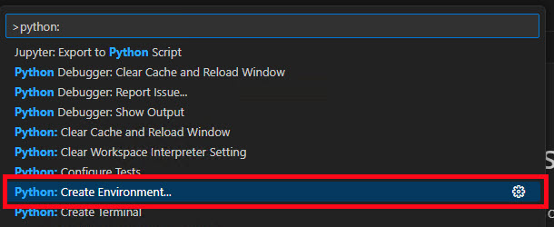
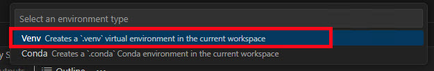
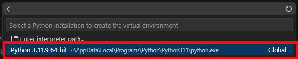
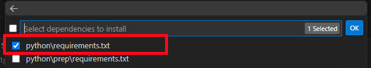

# Lab: Using LangChain to Build a RAG Application With Boston Azure's Youtube Transcripts

This is a set of Hands-on-labs (provided as notebook files) to walk you through building the main components of a RAG (Retrieval Augmented Generation) application.

The labs are broken into multiple notebooks:
1. [Lab 1: Build a Similarity Search for YouTube Transcripts](./1_search.ipynb)
1. [Lab 2: Build a RAG Application with LangChain, Part 1](./2_rag.ipynb)
1. [Lab 3: Build a RAG Application with LangChain, Part 2](./3_rag-with-chunking.ipynb)
1. [Lab 4: Build a RAG Application with LangChain, Part 3](./4_rag-with-azure-search.ipynb)

## Prerequisites

* [Python 3.11](https://www.python.org/downloads/)
  * **Important**: Python and the pip package manager must be in the path in Windows for the setup scripts to work.
  * **Important**: Ensure you can run `python --version` from console. On Ubuntu, you might need to run `sudo apt install python-is-python3` to link `python` to `python3`.
* [Git](https://git-scm.com/downloads)
* [VS Code](https://code.visualstudio.com/download)
* [VS Code Jupyter Extension](https://marketplace.visualstudio.com/items?itemName=ms-toolsai.jupyter)
* [VS Code Python Extension](https://marketplace.visualstudio.com/items?itemName=ms-python.python)

## Setup
1. Create a directory on you machine
1. Open a command prompt on that directory
1. Clone this repo 

```code
git clone https://github.com/JasonHaley/youtube-transcript-rag.git
```

4. On the command prompt change the directory and open VS Code by running these commands:
```code
cd youtube-transcript-rag
code .
``` 

This will open the directory in VS Code. 

5. Open the 1_search.ipynb file

6. Create a virtual environment by following these steps. If you need more detail on have problems take a look at [the section on Creating environments](https://code.visualstudio.com/docs/python/environments)

* Open the Command Palette (Ctrl+Shft+P), search for **Python: Create Environment** and select it



Choose **Venv** from the environment type choices



Select your python path from the interpreter list



Select the **python\requirements.txt** from the list of dependencies to install and click **OK**



This will take a *few minutes* to complete.

> NOTE: the python\prep\requirements.txt is only if you have a google dev api account and want to use some other youtube channel for transcripts

7. Create a `.env` file in teh python directory with the following variables:

```code
# macOS/Linux
AZURE_OPENAI_API_KEY = [ENTER AZURE OPENAI KEY HERE]
AZURE_OPENAI_ENDPOINT = [ENTER AZURE OPENAI ENDPOINT HERE]
AZURE_OPENAI_MODEL_DEPLOYMENT_NAME = gpt-35-turbo
AZURE_OPENAI_GPT_DEPLOYMENT_NAME = gpt-3.5-turbo
AZURE_OPENAI_EMBEDDINGS_DEPLOYMENT = text-embedding-ada-002
PLAYLIST_ID = PLvPK5LJMoQmnAFXxkxQKcjjDNZj6L4RQY

# Windows
AZURE_OPENAI_API_KEY = "[ENTER AZURE OPENAI KEY HERE]]"
AZURE_OPENAI_ENDPOINT = "[ENTER AZURE OPENAI ENDPOINT HERE]"
AZURE_OPENAI_MODEL_DEPLOYMENT_NAME = "gpt-35-turbo"
AZURE_OPENAI_GPT_DEPLOYMENT_NAME = "gpt-3.5-turbo"
AZURE_OPENAI_EMBEDDINGS_DEPLOYMENT = "text-embedding-ada-002"
PLAYLIST_ID = "PLvPK5LJMoQmnAFXxkxQKcjjDNZj6L4RQY"
```

Optional variable if you want to run the script to download your own Youtube transcripts:

```code
# macOS/Linux
GOOGLE_DEVELOPER_API_KEY = [ENTER GOOGLE DEVELOPER API KEY HERE]

# Windows
GOOGLE_DEVELOPER_API_KEY = "[ENTER GOOGLE DEVELOPER API KEY HERE]"
```


> Note: 
>
> There are two sets of transcripts:
> * Top 10 transcripts from the "Top 10" playlist
> * All transcripts from the 40 videos (they have the **_all_**)
>
> In order to 

Setup
Resources
References